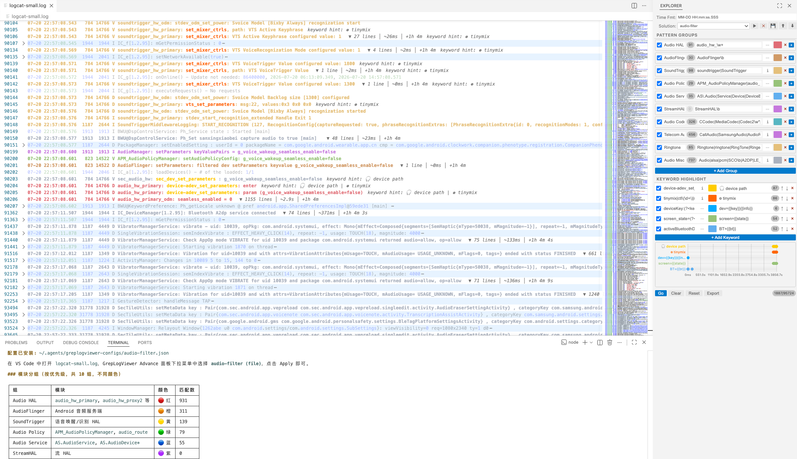

# Log--

> [English](README.md) | [中文](README_CN.md)

> 基于正则表达式的 VS Code 日志查看器 - 颜色高亮、自动折叠、关键字时间线、代码跳转，以及 AI 辅助配置。



---

## 概述

Log-- 将 VS Code 变成强大的日志分析工具。定义正则组对日志行着色，自动折叠无关内容，用子串级颜色高亮关键字，并在时间线上可视化关键字命中分布 - 所有效果由一个 **Go** 按钮触发。

适用于调试大型日志文件：Android logcat、内核日志、应用 trace 等。

---

## 功能

### 🎨 正则组着色与自动折叠

定义多个正则组，每组有颜色和多个表达式（支持 AND / OR / NOT 逻辑组合）。匹配行整行高亮；未匹配行**自动折叠**，只保留相关内容。

- 首组匹配优先（从上到下评估）
- 每个表达式可设 flags（忽略大小写、多行、dotAll）
- 折叠标注显示隐藏行数 + 时间跨度
- 切换文件后保留本次会话的折叠状态

### 🔍 关键字子串高亮

关键字在可见行内高亮特定子串，使用范围减法确保与行级颜色不冲突。

- **命名捕获支持**：正则中用 `(?<name>...)`，hint 中用 `{{name}}` 引用捕获值 - 每行显示实际匹配到的值
- **每个关键字独立作用域**：
  - `matched` - 仅在 group 匹配行内高亮
  - `full` - 全文扫描；仅关键字命中的行保持可见且**不折叠**（相当于额外的过滤组）
- **每个关键字独立的 ↑/↓ 导航**按钮，在该关键字的命中行之间跳转
- **实时计数**显示每个关键字的匹配数

**命名捕获示例**：
- 正则：`(?<pid>\d+)\s+(?<tag>\w+):`
- Hint：`pid={{pid}} tag={{tag}}`
- 行 `1234 MyTag: message` 显示：`pid=1234 tag=MyTag`

### ⏱️ 时间标注与自动检测

配置时间格式，或**留空**自动检测。支持格式：

| 日志类型 | 格式 | 示例 |
|----------|------|------|
| Android logcat | `MM-DD HH:mm:ss.SSS` | `01-23 12:00:00.123` |
| Android（无毫秒） | `MM-DD HH:mm:ss` | `01-23 12:00:00` |
| ISO 8601 | `YYYY-MM-DD HH:mm:ss.SSS` | `2024-01-23 12:00:00.123` |
| 内核 | 自动检测 | `[  1.234567]` |
| 仅时间 | `HH:mm:ss.SSS` | `12:00:00.123` |

每个折叠区域显示：`▼ N lines │ ~时长 │ +经过时间`

### 📊 关键字时间线

内嵌在侧边栏的 canvas 时间线图表，展示各关键字命中在时间轴上的分布。

- **滚轮缩放** - 在鼠标位置缩放，智能 tick 数量 + 子网格线
- **悬停 tooltip** - 显示关键字名、时间偏移、行号、匹配子串
- **点击跳转** - 点击任意点跳转到编辑器对应行
- **自动适应** - CSS 驱动 canvas 尺寸 + 100ms 轮询兜底，适应面板变化
- 时间轴起点为日志首个时间戳（或 ring-buffer 回绕点）

### 🚩 Ring Buffer 检测

检测环形缓冲区日志中的时间回绕（时间戳重置）。检测到的起点行用红旗图标标记，并保护不被折叠。

### 🖱️ 右键 Grep

在任意文件中选中文本 -> 右键 -> **Grep Keyword** / **Grep Function**：

- 搜索关联的代码目录（每个正则组可配置 `associatedDirs`）
- 结果输出到终端，用 `>>>` 分隔
- 支持分号分隔多目录、`!` 排除、`${VAR}` 环境变量
- `Grep Function` 可跨文件查找多行函数定义

### 📤 导出匹配行

点击 **Export** 将所有匹配行复制到新的未保存编辑器（`<文件名>_matched{n}`）：
- 以源文件名 + 计数器命名
- 自动设置 `log` 语言，支持语法高亮
- 适用于大文件无法折叠的场景

### 💾 配置共享与管理

- **保存 / 应用 / 删除** 命名配置（User 或 Workspace 范围）
- **导出 / 导入** JSON 文件
- 配置通过 VS Code 的 workspace/global state 跨会话持久化

---

## 🤖 AI 辅助配置

Log-- 内置 **Agent Skill**，让 AI agent（如 Pi、Claude Code 或任何兼容 Agent Skills 的工具）自动为任意日志格式配置过滤组、关键字和时间模式。

### 工作原理

1. **安装/更新插件时**，扩展自动将 `SKILL.md` 拷贝到 `~/.agents/skills/log-config/`
2. AI agent 读取 skill，分析你的日志样本，生成配置 JSON
3. Agent 将配置写入 `~/.agents/log-configs/<名称>.json`
4. 配置**自动出现在**侧边栏的 **Solution** 下拉列表中
5. 你只需选中并点击 **Apply** - 无需手动导入

### 示例：Agent 工作流

```bash
# Agent 写入配置文件：
mkdir -p ~/.agents/log-configs
cat > ~/.agents/log-configs/android-crash.json << 'EOF'
{
  "groups": [
    { "id": "g1", "name": "Fatal", "color": "#ff0000",
      "expressions": [{"id":"e1","pattern":"FATAL|ASSERT","flags":"","operator":"and"}] },
    { "id": "g2", "name": "Error", "color": "#ff6600",
      "expressions": [{"id":"e2","pattern":" E /|ERROR","flags":"","operator":"and"}] }
  ],
  "timePattern": { "format": "MM-DD HH:mm:ss.SSS" },
  "keywords": [
    { "id": "kw1", "pattern": "ANR in (?<app>\\S+)", "flags": "",
      "color": "#ff00ff", "matchScope": "full", "hint": "ANR: {{app}}" }
  ]
}
EOF
```

配置 `android-crash` 会以 `(file)` 范围出现在 Solution 下拉列表中。点击 **Apply** 加载，再点 **Go** 过滤。

### Skill 内容

内置 skill（`skills/log-config/SKILL.md`）包含：
- AI agent 的逐步配置流程
- 按日志类型的常见正则（Android、内核、通用应用）
- 命名捕获 hint 语法及实例
- 配置 JSON 结构参考
- 大文件处理指南
- 注意事项和验证步骤

---

## 📏 大文件支持

| 文件大小 | 行为 |
|----------|------|
| < 10 万行 | 全功能（过滤、折叠、时间线、变暗） |
| 10 万–30 万行 | 异步分块过滤 + 进度条；>20 万行禁用时间线 |
| >20 MB 或 >30 万行 | 跳过折叠（VS Code 限制）；提示用 **Export** 导出 |
| >50 MB | VS Code 硬限制 - 无法同步文件到扩展 |

对于超大日志（如 100 万+ 行的 Android dump），用 **Export** 提取匹配行到较小的编辑器，折叠即可正常工作。

---

## 使用方法

1. **打开** VS Code 中的日志文件
2. **配置** Log-- 侧边栏中的正则组和关键字
   - 或用 **Solution** 下拉列表应用已保存/agent 生成的配置
3. **点击 Go** - 匹配行着色，未匹配行折叠
4. **导航** - 用关键字 ↑/↓ 跳转命中行；滚轮缩放时间线
5. **导出** - 点击 Export 将匹配行复制到新编辑器

---

## 安装

在 VS Code 扩展商店搜索 **"Log--"**，或从 [Marketplace](https://marketplace.visualstudio.com/items?itemName=any-tool.log--) 安装。

---

## 开发

```bash
git clone <仓库地址>
cd log--
npm install
npm test          # 204 个单元测试
npx tsc --noEmit  # 类型检查
# 在 VS Code 中按 F5 启动扩展调试
```

### 架构

MVC 分层架构：
- **Model**：`RegexGroupModel`、`FilterResultModel`、`TimeMatchModel`、`ConfigStorageModel`、`RingBufferModel`
- **Controller**：`FilterController`（正则引擎）、`GrepController`（代码搜索）、`ViewController`（协调器）
- **View**：`ConfigPanel`（侧边栏 webview，含内嵌时间线）、`EditorDecorations`（高亮/折叠标注）

### 关键设计决策

- 使用 **FoldingRangeProvider** 声明式折叠（非手动 `createFoldingRangeFromSelection`）
- 使用 **WebviewViewProvider** 侧边栏（不抢编辑器焦点）
- **Go 按钮触发**所有效果 - 激活或切换编辑器时不自动生效
- **会话感知 attach**：切回已过滤文件时保留折叠状态

---

## License

MIT
